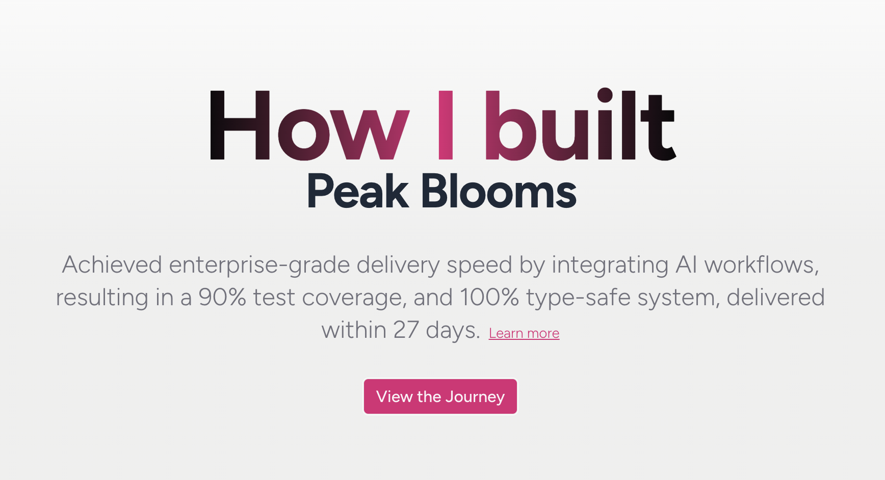

# Peak Blooms

> Full-Stack Architect Sprint: Evaluating React 19 and AI-integrated workflows for high-velocity system delivery.




## 📖 Overview

Peak Blooms is an interactive journey documenting the complete development lifecycle of a modern web application. This repository showcases the design decisions, technical implementations, challenges faced, and key learnings across a structured month-long development timeline.

Whether you're interested in web development best practices, design systems, or simply want to follow a real project from inception to completion, Peak Blooms provides insights into each phase of the development process.

## ✨ Features

- **Daily Progress Logs** - Detailed documentation of work completed each day
- **Weekly Milestones** - Key achievements and learnings organized by week
- **Interactive Timeline** - Explore the project journey through an intuitive interface
- **Design System Showcase** - Component-driven UI built with Tailwind CSS and shadcn/ui
- **Technical Insights** - Behind-the-scenes decisions and architectural choices
- **Code Syntax Highlighting** - Beautiful code examples with Shiki
- **Fully Responsive** - Optimized for desktop, tablet, and mobile devices

## 🚀 Getting Started

### Prerequisites

- Node.js 18+ 
- npm or your preferred package manager

### Installation

1. Clone the repository:
```bash
git clone https://github.com/yourusername/peak-blooms.git
cd peak-blooms
```

2. Install dependencies:
```bash
npm install
```

3. Run the development server:
```bash
npm run dev
```

4. Open [http://localhost:3000](http://localhost:3000) in your browser to view the application.

## 📋 Available Scripts

- `npm run dev` - Start the development server with hot reload
- `npm run build` - Create an optimized production build
- `npm start` - Run the production server
- `npm run lint` - Check code quality with Biome
- `npm run format` - Format code with Biome
- `npm run fetch-commits` - Fetch commit data from repository

## 🛠️ Tech Stack

### Core Framework
- **[Next.js 16](https://nextjs.org)** - React framework for production with App Router
- **[React 19](https://react.dev)** - UI library with concurrent features

### Styling & UI
- **[Tailwind CSS 4](https://tailwindcss.com)** - Utility-first CSS framework
- **[shadcn/ui](https://ui.shadcn.com)** - High-quality accessible component library
- **[@tabler/icons-react](https://tabler-icons.io)** - Icon library

### Development Tools
- **[TypeScript](https://www.typescriptlang.org)** - Type-safe JavaScript
- **[Biome](https://biomejs.dev)** - Fast unified toolkit for linting and formatting
- **[Shiki](https://shiki.matsu.io)** - Beautiful syntax highlighting
- **[Class Variance Authority](https://cva.style)** - Type-safe component variants

### Code Quality
- ESLint configuration via Biome
- TypeScript strict mode
- Automated formatting

## 📁 Project Structure

```
├── src/
│   ├── app/              # Next.js App Router pages
│   ├── components/
│   │   ├── dates/        # Daily progress components
│   │   ├── ui/           # Reusable UI components
│   │   └── *.tsx         # Main layout components
│   └── lib/              # Utility functions and helpers
├── commits-by-date/      # Daily commit data
├── public/               # Static assets and screenshots
└── next.config.ts        # Next.js configuration
```

## 📸 Screenshots

The project includes weekly progress screenshots in `public/screenshots/`:
- **Week 1** - Foundation & Planning
- **Week 2** - Feature Development  
- **Week 3** - Polish & Deployment

## 🎯 Project Journey

### Week 1: Foundation & Planning
Setting up the project infrastructure, establishing a design system, and creating the component foundation.

### Week 2: Feature Development
Building core features, integrating APIs, and implementing key functionality with comprehensive testing.

### Week 3: Polish & Deployment
Refinement, optimization, performance tuning, and final deployment to production.

## 📚 Key Learnings

This project demonstrates:
- Modern React patterns and best practices
- Building scalable design systems
- Component composition and reusability
- TypeScript for type-safe development
- Next.js App Router and layouts
- Tailwind CSS advanced techniques
- Performance optimization strategies
- Deployment and DevOps practices

## 🤝 Contributing

This is a documentation project showcasing a completed development journey. However, feedback and suggestions are welcome!

Feel free to:
- Open issues for bugs or improvements
- Submit pull requests with enhancements
- Share insights in discussions

## 📝 License

This project is licensed under the MIT License - see the LICENSE file for details.

## 👤 Author

Created as a detailed case study in modern web development and to share the complete journey of building a production-ready web application.

## 🔗 Resources

- [Next.js Documentation](https://nextjs.org/docs)
- [React Documentation](https://react.dev)
- [Tailwind CSS Documentation](https://tailwindcss.com/docs)
- [shadcn/ui Components](https://ui.shadcn.com)
- [TypeScript Handbook](https://www.typescriptlang.org/docs/)

---

Made with ❤️ documenting the journey of Peak Blooms
